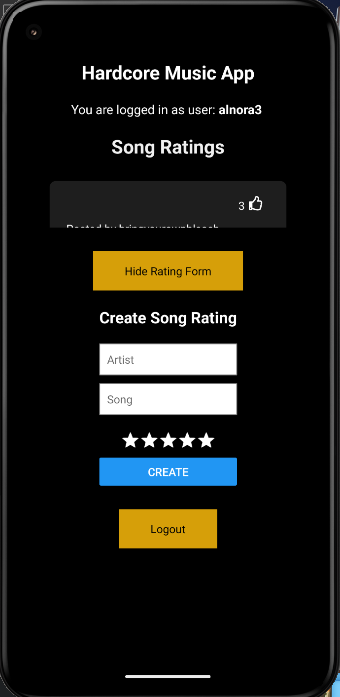
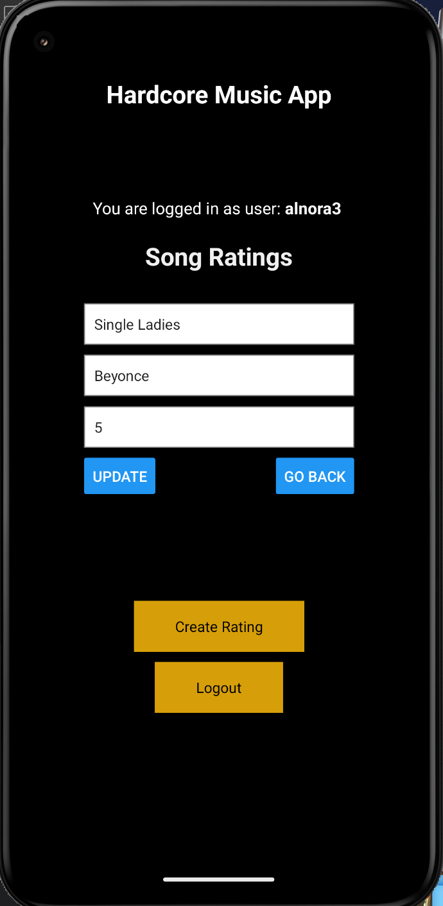

# Darling Rodriguez & Lily Edelman - Software Engineering @ Wesleyan University

This is a full-stack React Native application made under the course COMP333: Software Engineering. The idea of this project is to create an application where users can log in, upload songs, and rate them, as well as view songs rated by other users in the community. This application makes user for CRUD opearations by utilizing the backend RESTApi and connecting it with the front-end.

# Local Set Up

In order to run our application, you have to follow some steps to set up a local environment in terms of databases and servers. These steps to set up the back-end follow similar set-up as our previous assignment.

## 1. XAMPP Set up

In order to set up databases, you need to install or have XAMPP in your local environment (Computer).[Here is where to download XAMPP](https://www.apachefriends.org/)

The first thing once XAMPP is downloaded and installed is turn the necessary servers on: MySQL Database & Apache Web Server. To do this, navigate to where XAMPP was installed, navigate to the XAMPP folder, and open the Manager. In MacOS it is called "manager-osx". Once there, start those two servers. 

## 2. phpMyAdmin Set Up

On a browser, open the [localhost/phpmyadmin/](http://localhost/phpmyadmin/) in order to access this database. Note that this often takes a while to open and load. 

Once open, to create the template database, [download this SQL file](./Other_Files/music_db_test.sql) on your computer. 

With that file downloaded, navigate to the "Import" section on the top bar of phpMyAdmin. Upload that SQL file that was just downloaded and import it. You should be able to see your new database with two tables: users and ratings.

## 3. XAMPP Backend files

With our database now set up, we can start getting our project files in the right location. Navigate inside your local XAMPP folder and open it. Once in, you should find a folder called 'htdocs'. Open this folder and delete everything except two folders: 'img' and 'dashboard'. 

After cleaning this 'htdocs' folder, create a folder for your backend files. It is important that you remember what you name this folder, as we will need its name to access it later on. 

Once you create a project folder, navigate inside it and copy and paste the folders from the repo called 'Model' and 'Controller' into this project folder. These are our backend RestApi files that follow the MVC (Model-View-Controller) pattern. For the 'View' we will focus on it later.

Inside the Model folder, you will find the database.php file, which is what connects these files to the database in phpMyAdmin that we made previously. If you made your own database or changed the name of the one we provided, make sure to reflect those name changes in this file, specifically on this line:

```php
$this->db = new mysqli('localhost', 'root', '', 'music_db_test');
```

If you renamed the database, replace 'music_db_test' with your new name. If you didn't, skip this step.

## React Native Set Up
Now that we have our backend files and database in our local environment, we want to focus on setting up our front end, specifically creating our React Native application.

We will begin by opening our terminal and navigating to any folder that we would like to store our application. This does NOT have to be inside our XAMPP folder, you can place this anywhere that you can access on your local computer folders.

Once you have navigated where you want to create your app, in the terminal, within the project directory, run this line:

```bash
npx create-expo-app <YourAppName>
```

if this doesn't work for authorization issues, try:

```bash
sudo npx create-expo-app <YourAppName>
```
and enter your device's password.

## React Native Environment Set Up

With the app now intalled in our terminal, we can start the app by running the command:

```bash
npx expo start
```

In order to fully test run our application, we need to download an emulator. We will provide the steps to test deploy the app on an Android Virtual Device (AVD). Follow these steps to install Android Studio on https://developer.android.com/studio.

Once installed, follow [these steps](https://developer.android.com/studio/run/managing-avds) to build and run an AVD.

We will be using the Pixel 5 API 34 for our device.

With this running properly, we can run our command again:
```bash
npx expo start
```
and click a to open on Android, and you will notice the emulator opening the template app that we just installed.

## Important Packages to Install

In order for the application to work properly and for all the 'imports' to function, we need to install in our terminal a couple of packages.

With the terminal open, run the line:

```bash
npm install watchman
```

and 

```bash
npm i react-native-vector-icons 
```
and
```bash
npm install axios
```

Remember to put 'sudo' in front of these lines if you are having authorization issues.

## Importing React Native Files

Now with the application fully functioning and deploying on the emulator, we can now replace the existing files in this application with the ones in our repo.

With an editor, preferably VSCode, open the project directory folder copy and paste all of the files inside the View folder of our repo onto the React Native project files. 

In our project, instead of using Localhost as our API call points, we use our IP address, so change these accordingly. So if you see any links that look like this:

```js
...axios.get(`http://139.143.190.217/homework3/Controller/RestApi/Ratings/Read_ratings.php`)...
```

It is crucial that you change that to the directory of that associated file. The 'http://129.133.190.217/' is referring to the XAMPP htdocs, so whatever you decide to call your backend files in the htdocs should be after.

For example, my folder is called 'homework3' and my 'Model' and 'Controller' folder are in there, so my link will then be ''http://129.133.190.217/homework3/' and the path to whatever file I want to link will be after. 

In order to find out what your IP adress is, one way to find out on a MacOs, is to go to a terminal window and running the line:

```bash
ifconfig
```

You will get a load of text, make sure to find the 'en0' and right next to 'inet' you will see your IP, such as 'inet 123.133.490.517'

# Running the Application

After following all those steps correctly, you can run this line again:
```bash
npx expo start
```

and see a working application that you can use. If there are any errors, read what files and lines they are coming from and make sure you have linked everything correctly between the React Native files and the backend files in the htdocs folder of the XAMPP application folder.


# Added Functionality

For this assignment, the application has a new functionality not listed within the document of recommendations.

We decided to implement a way for a user to like song ratings (only one like), and each user is able to do this. This allows for all users to show love for other people's ratings.

This functionality allows for a user to unlike the song if it was already liked. A list of the user and the song they liked will be sent to a table in our database called user_likes and this keeps track of who liked a song. 

The like button is represented with a thumbs-up icon, as well as a number besides it representing the amount of overall likes it received across all users.

# Work Divided
We both did 50/50 of the work in this homework. We both equally agree that we worked on this equally for every step, work commited and new lines added were sometimes worked on collaborately from one computer as well.


## Some Images of Application:






